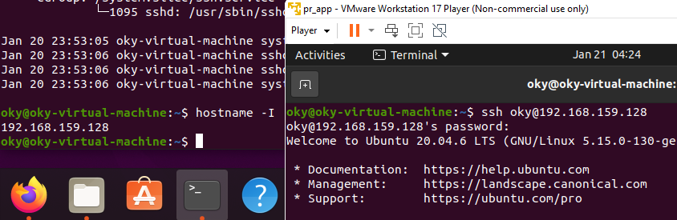
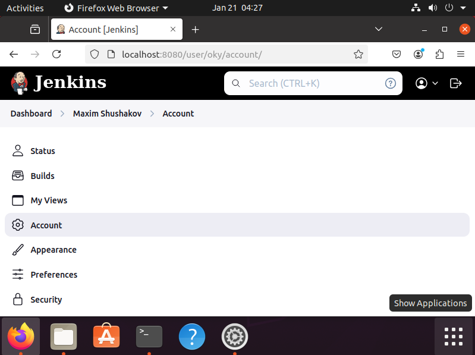
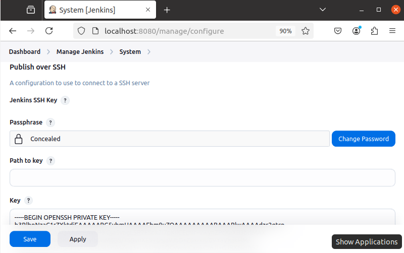
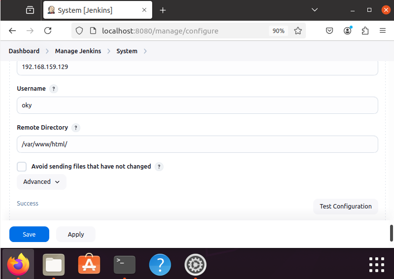
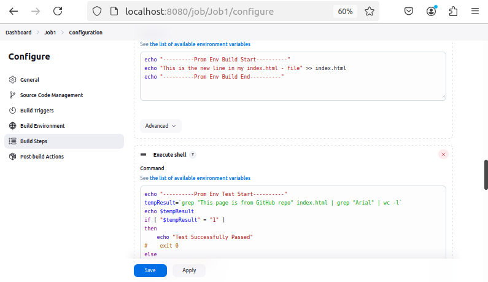
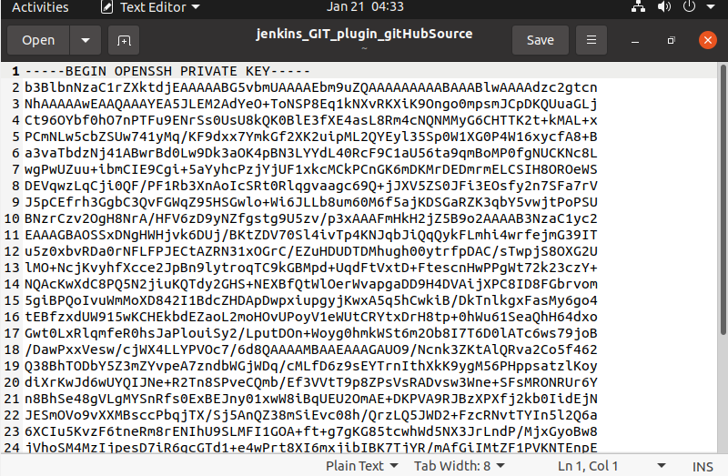
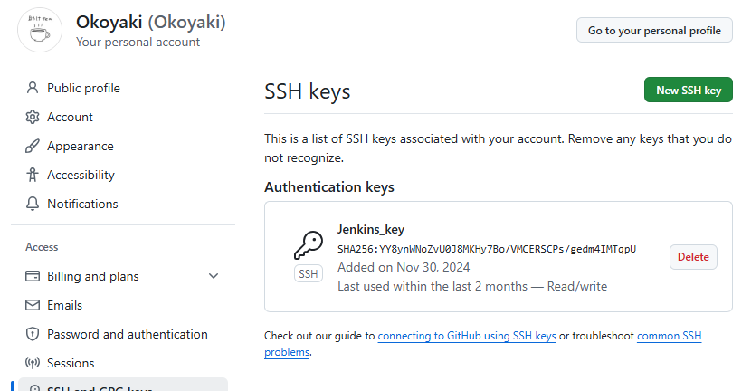
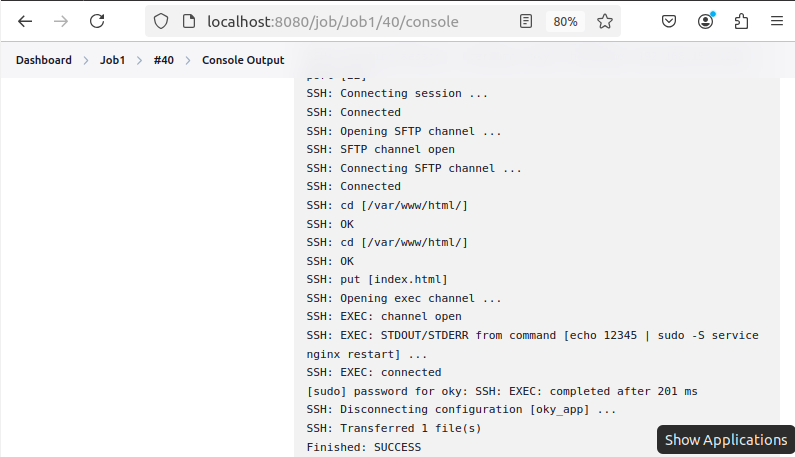
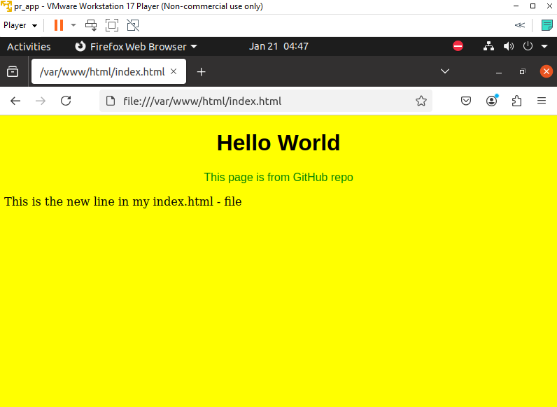

# Практическое задание. Jenkins
Данный проект был разработан в рамках практического занятия курса "Методология разработки программного обеспечения DevOps" студентом Шушаков М.С.
## 1. OpenSSH-Server
Для связи между двумя ВМ был установлен `openssh-server`. Адрес сервера pr_server - `192.168.159.128`, адрес приложения pr_app - `192.168.159.129`.

На стороне сервера pr_server сгенерирован RSA-ключ и отправлен на сторону клиента pr_app. Подключение через команду `ssh` прошло успешно

## 2. Jenkins
На сторону сервера был установлен и запущен Jenkins. В качестве плагинов были дополнительно установлены GIT, Publish Over SSH и GitHub. Также был создан основной пользователь (Maxim Shushakov)

Далее был создан репозиторий Jenkins-Test, на который был выложен index.html с кодом, указанным в задании.

Для связи с ВМ pr_app, на которую будет отправляться файл index.html, была сгенерирована пара публичного и приватного ключей. 

Публичный ключ был дописан в файл с авторизованными ключами на стороне ВМ pr_app, а приватный ключ добавлен в настройки Jenkins, с указанием адреса ВМ pr_app, а также имени её пользователя и директории, с которой будет взаимодействовать Jenkins. Проверка соединения прошла успешно.

Далее был создан и настроен Jenkins Job, с добавлением двух шагов Execute Shell и конфигурацией Post-build Actions 

Для связи Jenkins и GitHub на стороне сервера pr_server был сгенерирован ключ. Публичная часть была добавлена на GitHub, приватная часть добавлена в настройки Jenkins Job

Далее был проведен запуск полученного Jenkins Job. Запуск прошёл успешно, страница index.html на стороне ВМ pr_app изменилась.

Конфигурация Jenkins Job была экспортирована и выложена в этот репозиторий в виде файла Job1.xml.

